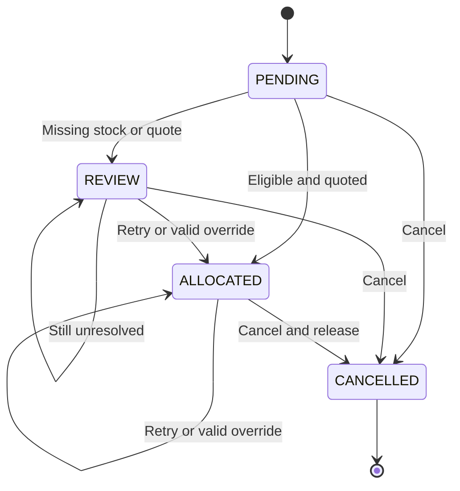

# Architecture and decisions

## Service boundary

Next.js serves a mostly static shell; a client component requests the current workspace through GraphQL. Apollo Server runs inside a Node.js route handler. The backend business rules live in `RoutingService`, not in React or GraphQL resolvers. A worker or future REST webhook adapter could call the same service.

The application uses direct parameterized SQL rather than an ORM. The important operations here are locks, conditional updates, and transactions; keeping those visible makes the behavior straightforward to inspect. Adding an ORM is not necessary to demonstrate TypeScript or GraphQL.

## Allocation sequence

`route(sessionId, orderId)` reads the immutable order input, obtains both simulated quotes concurrently, and only then enters the transaction. It locks the workspace row, reloads the order, and reads current inventory. The captured quotes are reused while evaluating the fresh stock snapshot. No external request runs while holding the database lock.

An already allocated order returns its existing result unless an explicit override is requested. A cancelled order rejects routing. An unresolved evaluation sets the order to `REVIEW`, writes the decision and audit event, and does not reserve anything.

A successful selection uses a conditional update for every SKU:

```sql
UPDATE inventory
SET reserved = reserved + $4
WHERE session_id = $1
  AND warehouse_id = $2
  AND sku = $3
  AND on_hand - reserved >= $4
RETURNING sku;
```

Zero returned rows means the reservation cannot be made. Any failure rolls back the complete transaction. SQL constraints independently enforce `0 <= reserved <= on_hand`.

## Concurrency and lock granularity

Every inventory-changing service method takes `SELECT ... FOR UPDATE` on the same workspace row. Independent PostgreSQL connections modifying that workspace therefore serialize. Dashboard reads use the same lock to produce a consistent multi-table view. Preview is advisory and does not take that lock.

This is intentionally coarse. There is no claim of high-throughput warehouse scheduling. A production system should use narrower order/inventory locks with consistent acquisition order, bounded deadlock retries, and representative load tests. PGlite serializes its embedded transactions; use the separate-pool PostgreSQL integration test to validate contention on the server adapter.

## Overrides and cancellation

An override reevaluates availability, counting the order's own old reservation as available to itself. It validates the requested destination warehouse and quote, releases the previous reservation, creates the replacement reservation, updates the order, and writes the audit event in one transaction. Failure keeps the old reservation intact.

Cancellation is terminal and idempotent. It releases stock only when the current order is allocated, then changes the state to cancelled. The old decision remains as a historical snapshot; the order's active warehouse is cleared.



## Data model

| Table         | Key                           | Purpose                                                |
| ------------- | ----------------------------- | ------------------------------------------------------ |
| demo_sessions | id                            | Browser workspace and coarse lock target               |
| inventory     | session_id, warehouse_id, sku | On-hand and reserved counts with constraints           |
| orders        | session_id, id                | JSONB order input, state, and latest decision snapshot |
| audit_events  | id                            | Ordered event history scoped to a workspace            |

JSONB avoids migration overhead for this small snapshot-shaped demo. The tradeoff is weaker database enforcement of order fields and less convenient reporting. A larger system would normalize orders, lines, reservations, quotes, and allocation attempts, with versioned migrations and database foreign keys for products/warehouses. The current idempotent schema initialization only creates the initial schema; it is not a migration framework for future alterations.

## Shipping adapter

`ShippingProvider.quote()` takes warehouse, sample destination, and line items. The simulator returns integer cents, synthetic transit days, and great-circle distance. It throws for Reno on the quote-outage scenario. Automatic routing requires every eligible quote. An explicit override can accept an available quote, while preserving `complete: false`.

A real adapter needs authenticated server-side requests, an address/parcel model, account rates, dimensions, service constraints, currencies, quote timestamps/expiry, timeouts, bounded retries, and response validation. The current simulator is immediate; no retry worker or quote TTL is implemented. Geographic closeness is not assumed to predict actual negotiated carrier rates.

## GraphQL choices

The schema exposes connected orders, destinations, products, warehouses, and decisions. Nested product/warehouse resolvers read the in-process fixture catalog; they do not issue one SQL query per row. There is no DataLoader in this implementation because these relationships do not create an N+1 database problem. If catalog data moves into SQL, revisit batching or joins.

The frontend uses `fetch` and shared domain interfaces, not Apollo Client. A full workspace refresh after mutations keeps cache behavior simple. Schema-driven operation type generation is a future improvement; shared TypeScript types alone do not prove a query's response shape. The API test executes the actual dashboard query to catch schema drift.

The API rejects fragments, allows one top-level mutation field per request, caps field count at 200, and limits request text to 16,000 characters. These are explicit demo restrictions, not a general GraphQL cost-control solution. Introspection stays enabled for exploration. There is no production rate limiter.

## Isolation and security

A randomly generated UUID stored in an HTTP-only, same-site cookie identifies a demo dataset. Every database query scopes access by that ID. This is an unguessable demo capability, not identity verification or role-based access. A holder of the cookie can access that dataset. Do not put real customer data into it.

The endpoint accepts JSON POST only, rejects cross-origin browser requests, uses parameterized SQL, validates mutation input with Zod, and hides unexpected resolver errors. The public-demo threat model does not address resource-exhaustion attacks; before external exposure add request-rate limits, session expiry cleanup, authentication where appropriate, and infrastructure protections. A reverse proxy must preserve the effective origin correctly.

## Further work, in order

1. Real authentication and role checks if using non-demo data.
2. A carrier adapter with quote expiry and resilient timeouts.
3. Normalized reservations, expiry/confirmation states, and versioned migrations.
4. Idempotency keys for order ingestion; routing existing orders is already idempotent, creation is not.
5. Cursor pagination, generated operation types, structured logs and latency metrics.
6. Narrower locking and measured throughput testing.
7. Split shipment optimization, only after defining handling costs and service requirements.
